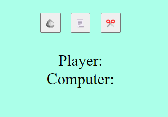
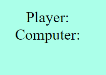
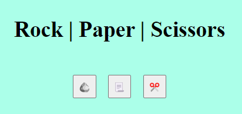

# RockPaperScissors

RockPaperScissors is a site that hopes to encourage curious people to take a break from their work and have some fun playing a game against a computer which demonstrates the use of javascript. RockPaperScissors game built using primarly javascript which allow users to endlessly play games of rock,paper,scissors against a computer.

## User Experience

### User Stories

1. As a user who is bored and want to play a game
2. I expect to find a simple and easy to learn game
3. As someone who is interested in the demonstration of javascript
4. I expect to play a game built using javascript
5. As a user who wants to learn the rules to the game
6. I expect to find the rules of the game within the webpage
7. As a user who is looking to track how i have been doing in the game
8. I expect to see a score tracker

## Design

### Wireframe

The wireframe created and used- [Wireframe](assets/images/wireframe.png)

## Features

### Current Features

* #### Heading

    * This section clearly demonstrates to users what game they will be playing. As its a game familiar with most people, users will immediately know if they will like the game or not.

* #### Game Area

    * The area consists of the buttons for the rock, paper and scissors which start the game. This area also shows the decisions the user as well as the computer has made which will be followed by a comment saying who won the game. This allows for easy understanding of the game as the layout is simple and the programme will tell the user who has won or lost or tied in the game.

* #### The Score Tracker

    * The score tracker accumaltes the points between the user and the computer after each game is played. This is useful for a user who wants to play multiple times and easily keep track of how well they are doing.

* #### Footer

    * This section states the rules of the game. This is for users who have never played the game before who wants to know how it works.

### Feature ideas to implement

* To be able to play with other players
* A leaderboard showing people who have played the game with the most wins
* A rate and review section

## Testing

### Validator testing

* HTML has been validated using <https://validator.w3.org/nu/?doc=https%3A%2F%2Fbahraamk.github.io%2FRockPaperScissors%2F> , no errors were found
* CSS has been validated using <https://jigsaw.w3.org/css-validator/validator?uri=https%3A%2F%2Fbahraamk.github.io%2FRockPaperScissors%2F&profile=css3svg&usermedium=all&warning=1&vextwarning=&lang=en>, no errors were found

### Lighthouse testing

* The site scored 100 on mobile accessibility using [Pagespeed](https://pagespeed.web.dev/analysis/https-bahraamk-github-io-RockPaperScissors/h9m5avglt7?form_factor=mobile)
* The site scored 100 on desktop accessibility using[PageSpeed](https://pagespeed.web.dev/analysis/https-bahraamk-github-io-RockPaperScissors/h9m5avglt7?form_factor=desktop)

### General testing

* I used the site on my personal phone and laptop and it has been used by family members with different types of phones
* The site was checked at different sized devices using developer tools

### Bugs

#### Known, Unfixed Bugs

* All bugs known that occured during testing has been fixed.

#### Fixed Bugs

* Score tracker would not work. I fixed this by declaring a variable which allowed score values to begin from 0.
* Keywords were showing up as undefined. I fixed this by rearranging the positions of the curly bracket to correct the scope.

## Deployment

1. The deployment process for the site was too GitHub Pages and involved the following steps:
2. Go to the Settings tab within the GitHub repository.
3. Under the general settings, within the code and automation channel, select the pages tab.
4. Under the subheading "branch", select the main branch.
5. Click the save button, refresh the page and wait a couple inutes to see the live site link towards the top of the page.
RockPaperScissors live link- <https://bahraamk.github.io/RockPaperScissors/>

## Credits

### Content

* The template used was the [CI full template](https://github.com/Code-Institute-Org/ci-full-template)
* Some inspiration for the switch statements came from [W3schools](https://www.w3schools.com/).

### Media

* The image used in the webpage was obtained from [pinterest](https://www.pinterest.co.uk/pin/388365167884184835/). The link contains the user the image was obtained from as well as a link to their website.
